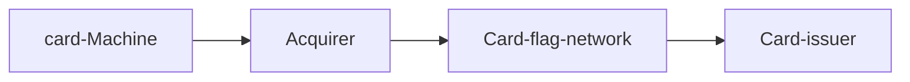

# Risk Analise

  

the main reason of this application is to validate a transaction.

and respond if it is kinda a possible chargeback.

the answer is on the bottom here

# dependencies

  

- RUBY VERSION 2.7.3

- POSTGRESS 9.6

  

# prepare database

  

- change .env with database host config

- create database with docker compose

- docker compose up -d postgres

  

* Development

- rake db:drop db:create db:migrate

* tests

- RACK_ENV=test rake db:drop db:create db:migrate

  

# run tests

  

- rspec -fd

  

# run server

  

- ruby src/app -s puma

  

# Coverage

  


  

# Understand the Industry

  

##### 1. Explain the money flow and the information flow in the acquirer market and the role of the main players.

  
1. Machine flow
	- customer goes to a store, pays with credit card or debit card
	- the aquirer is the company the provides de card machine
	- card flag network is in charge of find the card-issuer through Bin number
	-  Bank identification number
	- the card issue is in charge of verify if the customer has money for this transaction
	

2. E-commerci flow
	- the e-commerce needs a sub-Acquirer or a payment gateway 
	- in order to charge a e-commerci customer
	- and from the point is the same of the credit card
	
  ```mermaid
  graph LR;
		E-commerci-->sub-Acquirer;
		E-commerci-->Payment-Gateway;
		sub-Acquirer-->Acquirer;
		Payment-Gateway-->Acquirer;
		Acquirer-->Card-Flag-Network;
		Card-Flag-Network-->Card-issuer
		  
  ```
3. the main acquirer of brasil 
	- rede
	- getnet
	- cielo
	-  Stone
3.1 the main sub-aquirer of brazil
	- PagSeguro
	-  SumUp
	-  Mercado Pago

##### 2. Explain the difference between acquirer, sub-acquirer and payment gateway and how the flow explained in question 1 changes for these players.
 - Acquirier is directly connected on the card-flag-network
 - A sub acquirier needs to connect into a acquirier, a sub acquirier offer anti fraud service 
 -  A Payment gateway only process payment and store it and sent to a acquirier to charge.
 
##### 3. Explain what chargebacks are, how they differ from cancellations and what is their connection with fraud in the acquiring world.
- chargeback is a disputed charge by the owner of the card and the value needs to be returned
- cancellation is when retailer performe the cancelation and there is no dispute
- a cancellation can be aske by the customer in a e-commerce enviroment.
- when a cancelation is asked by a e-commerce it cam be a fraud.
- and will be a chargeback
- when the credit card was stolen it will be a chargeback too.
  

# Get your hands dirty

##### 1. Analyze the data provided and present your conclusions (consider that all transactions are made using a mobile device).

  - Analising the file we can notice that some user uses many differents card
  - Transactions at night 
  - many transaction in short minutes

##### 3. In addition to the spreadsheet data, what other data would you look at to try to find patterns of possible frauds?
- Geolocation if it is to far from the client purchases habits
- the product category is diferent from purchases habits
